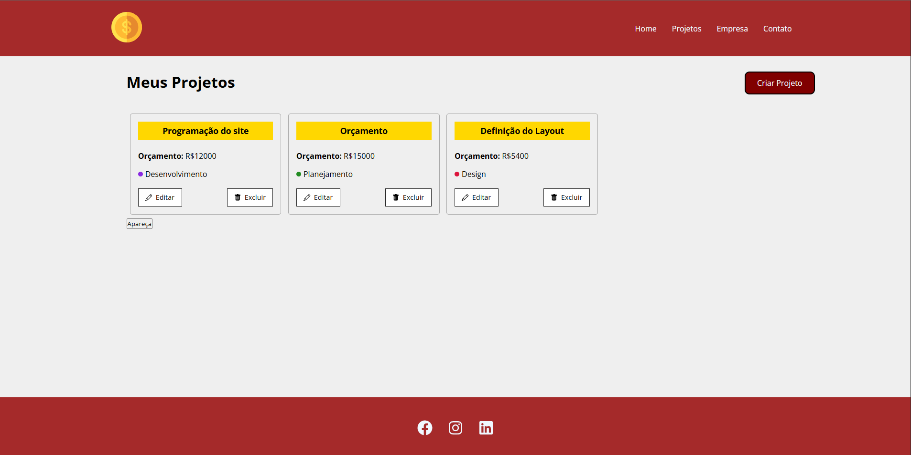
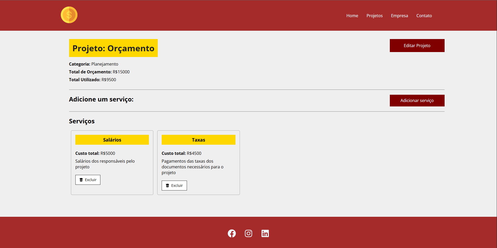

# Site react costs

### Site de gerenciamento de projetos realizado utilizando React no frontend e Node.js no backend

- Permite adicionar, editar e excluir projetos
- Permite adicionar aos projetos serviços que preenchem o orçamento estabelicido para o determinado projeto
- Projetos são salvos em um banco de dados rodando em outra instância

## Página inicial do site

## Página dos projetos

## Página dos serviços do projeto

